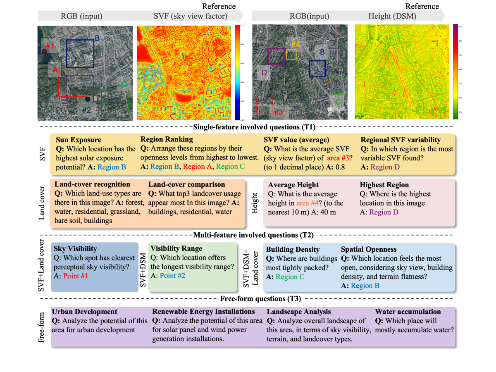

<h2 align="center">
  Geo3DVQA: Evaluating Vision-Language Models for 3D Geospatial Reasoning
from Aerial Imagery
</h2>

<h5 align="center">Mai Tsujimoto,
<a href="https://junjue-wang.github.io/homepage/">Junjue Wang</a>,
<a href="https://weihaoxuan.com">Weihao Xuan</a>,
<a href="https://naotoyokoya.com/">Naoto Yokoya†</a></h5>

<h5 align="center">
† Corresponding Author</h5>

Three-dimensional geospatial analysis is critical to applications in urban planning, climate adaptation, and environmental assessment. Current methodologies depend on costly, specialized sensors (e.g., LiDAR and multispectral), which restrict global accessibility. Existing sensor-based and rule-driven methods further struggle with tasks requiring the integration of multiple 3D cues, handling diverse queries, and providing interpretable reasoning. We hereby present Geo3DVQA, a comprehensive benchmark for evaluating vision-language models (VLMs) in height-aware, 3D geospatial reasoning using RGB-only remote sensing imagery.  Unlike conventional sensor-based frameworks, Geo3DVQA emphasizes realistic scenarios that integrate elevation, sky view factors, and land cover patterns. The benchmark encompasses 110k curated question–answer pairs spanning 16 task categories across three complexity levels: single-feature inference, multi-feature reasoning, and application-level spatial analysis. The evaluation of ten state-of-the-art VLMs highlights the difficulty of RGB-to-3D reasoning. GPT-4o and Gemini-2.5-Flash achieved only 28.6\% and 33.0\% accuracy respectively, while domain-specific fine-tuning of Qwen2.5-VL-7B achieved 49.6\% (+24.8 points). These results reveal both the limitations of current VLMs and the effectiveness of domain adaptation. Geo3DVQA introduces a new frontier of challenges for scalable, accessible, and holistic 3D geospatial analysis. The dataset and code will be released upon publication at \url{https://github.com/mm1129/Geo3DVQA}.



## News
- 2025/11/11, our paper [Geo3DVQA: Evaluating Vision-Language Models for 3D Geospatial Reasoning
from Aerial Imagery] accepted to WACV 2026
- 2025/11/28, Preparing the dataset/code release and camera-ready materials

## ToDo
- [ ] update code & data

## Data preparation

I'll provide the dataset link soon.
The small example containing 3000 QAs (short answer + freeform) are in .

## Evaluation Protocol
- Decoding: temperature=0 (greedy) unless otherwise noted. When `temperature>0`, report mean±std over 3 runs (appendix).
- Multiple-choice scoring: category-specific rules implemented in `inference/calc_acc_res.py` (e.g., Jaccard≥0.7 for `landcover_type`, order-independent exact set for `land_use`, 30% relative or <10 absolute tolerance for `height_average`, ±0.05 for `hard_pixel`).
- Free-form evaluation: GPT-based automatic scoring with temperature=0.0; NaN assigned when the corresponding GT domain is absent. Evaluation traces are saved.


### Notes on default data paths
- Some example and auxiliary scripts use default paths like `/workspace/GeoNRW` or `../SynRS3D/GeoNRW_dsm` for convenience. These are merely samples. Please adjust them according to your environment using CLI arguments (e.g., `--image_dir`, `--dsm_dir`, `--svf_dir`, `--seg_dir`, etc.) as needed.

## Benchmark (examples)
- Example 1: Full-modality inference (RGB+DSM+SVF+SEG)
```bash
python inference/svf_qa_multi.py \
  --questions_file path/to/questions.jsonl \
  --image_dir /path/to/images \
  --modalities rgb,dsm,svf,seg \
  --output_file results.jsonl \
  --temperature 0
```
- Example 2: RGB-only inference
```bash
python inference/svf_qa_multi.py \
  --questions_file path/to/questions.jsonl \
  --image_dir /path/to/images \
  --modalities rgb \
  --output_file results_rgb_only.jsonl \
  --temperature 0
```

## Project Structure
(some will be added later)
```
Geo3DVQA_v0/
├── core_release/          # Minimal wrappers and paper-aligned quickstart
│   └── scripts/           # generate_qas.sh / inference.sh / evaluate_*.sh
├── generate_qas/          # Question generation scripts
│   ├── run.py
│   ├── freeform_qa_generation/
│   └── visualize_qa_*.py
├── inference/             # Inference and evaluation
│   ├── svf_qa_multi.py
│   ├── calc_acc_res.py
│   └── gpt4_evaluation*.py
└── run_llama_factory/
    └── inference/
```

## Documentation

### Data Format
Input (JSONL):
```json
{ "question_id": "unique_id", "text": "Question text", "image": "relative/path/to/image", "category": "category_name" }
```
Output (JSONL):
```json
{ "question_id": "unique_id", "text": "Question text", "answer": "Model answer", "image": "relative/path/to/image", "category": "category_name", "used_modalities": ["rgb", "dsm", "svf", "seg"] }
```

### Modalities
- RGB: Standard aerial/satellite RGB images
- DSM: Digital Surface Model (elevation data)
- SVF: Sky View Factor (openness measure)
- SEG: Land use segmentation maps

## Disclaimer
**Important**: This repository contains a refactored reference implementation of the method described in our paper. For readability and maintainability, the code has been reorganized and some parts might be modified or added for additional experiments after the paper was written.
However, the implementation reflects the same core methodology and is intended as a basis for reproducing and extending our work.

## Citation
```text
% Add citation here (BibTeX/Reference)
```

## Acknowledgments
This project builds upon public geospatial datasets and community tools in remote sensing and multimodal learning. We thank the maintainers and contributors of the referenced projects.

We used GeoNRW dataset for RGB, DSM (digital surface model), segmentation.
GeoNRW is available on .
SVF (sky view factor) was generated using UMEP from the DSM.

## License
All images and their associated annotations in Geo3DVQA can be used for academic purposes only, but any commercial use is prohibited.

